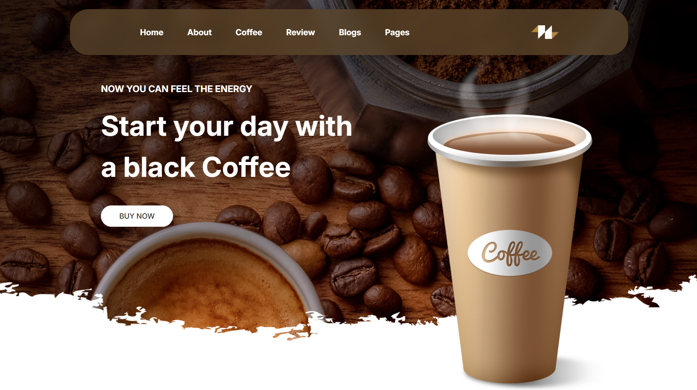
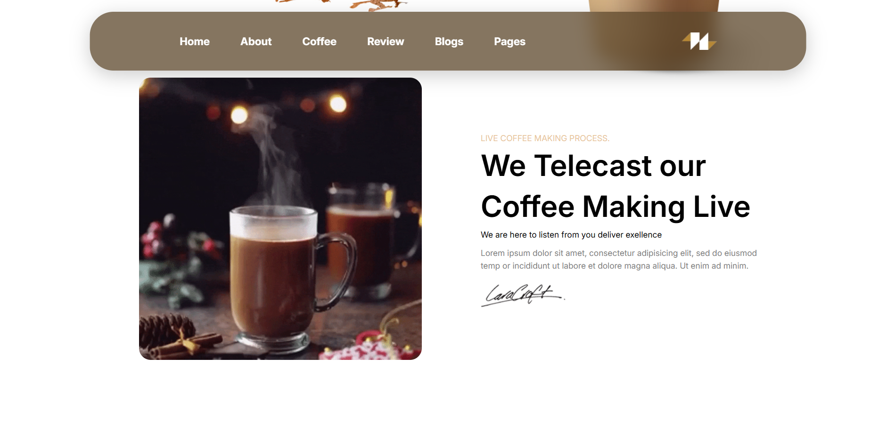
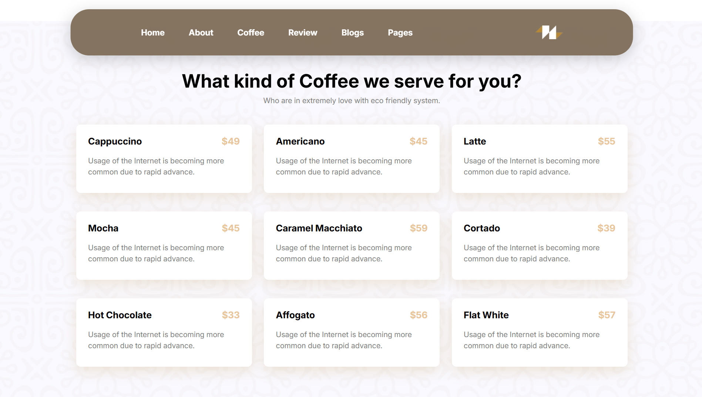
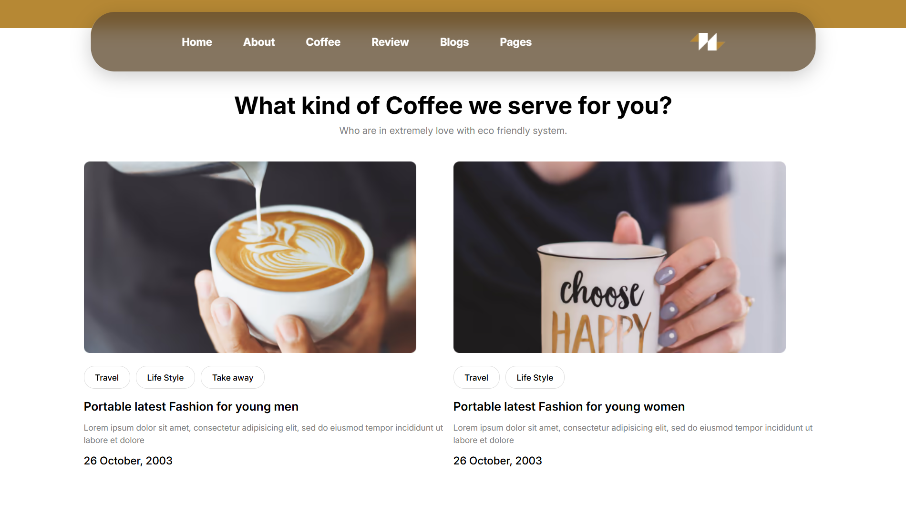

# ☕ Black Coffee

A modern, fully responsive coffee shop website built with pure HTML, CSS, and JavaScript. Perfect for showcasing coffee products and services with an elegant design.

**[🌐 Live Demo](https://arashazarii.github.io/Black-Coffee/)**

---

## 📸 Screenshots





### 💻 Desktop View


The full desktop experience showcasing:
- Complete navigation menu
- Hero section with call-to-action
- Coffee menu with pricing
- Product gallery
- Customer testimonials and statistics
- Blog section
- Footer with social links

### 📱 Mobile View


Fully optimized mobile experience featuring:
- Responsive navigation (hamburger menu)
- Touch-friendly buttons
- Mobile-optimized layout
- Fast loading times
- Seamless scrolling

---

## 🎯 Project Overview

**Black Coffee** is a practice project demonstrating modern web design principles. It's a beautifully designed coffee shop website that showcases various coffee products with pricing, customer reviews, and blog content.

### Key Features
- ✅ **Fully Responsive Design** - Works perfectly on desktop, tablet, and mobile devices
- 🎨 **Modern UI/UX** - Clean and elegant dark-themed design
- 🍰 **Coffee Menu** - Display of various coffee types with prices
- 📸 **Product Gallery** - Showcase of coffee and products
- 💬 **Customer Reviews** - Testimonials section
- 📰 **Blog Section** - Articles and lifestyle content
- 🔗 **Social Integration** - Links to social media platforms

---

## 🚀 Getting Started

### Prerequisites
- Any modern web browser (Chrome, Firefox, Safari, Edge)
- VS Code or any code editor (optional)
- Live Server extension for VS Code (recommended)

### Installation

1. **Clone the repository:**
   ```bash
   git clone https://github.com/Arashazarii/Black-Coffee.git
   cd Black-Coffee
   ```

2. **Open with Live Server:**
   - Right-click on `index.html`
   - Select "Open with Live Server"
   - The website will open in your default browser

3. **Or open directly:**
   - Simply double-click `index.html` to open in your browser

---

## 📁 Project Structure

```
Black-Coffee/
│
├── index.html              # Main HTML file
├── README.md              # Project documentation
│
├── css/
│   └── style.css          # All styles and responsive design
│
├── js/
│   └── script.js          # JavaScript functionality
│
└── assets/
    └── images/
        ├── logo/          # Logo and brand images
        ├── coffee/        # Coffee product images
        ├── gender/        # Gender-specific lifestyle images
        └── introduction/  # Author introduction images
```

### File Descriptions

| File | Purpose |
|------|---------|
| `index.html` | Main structure and content |
| `css/style.css` | Styling and responsive breakpoints |
| `js/script.js` | Interactive features and animations |
| `assets/` | Images and media files |

---

## 💡 Technologies Used

- **HTML5** - Semantic markup and structure
- **CSS3** - Modern styling with flexbox and grid
- **Vanilla JavaScript** - Pure JavaScript without frameworks
- **Responsive Design** - Mobile-first approach

---

## 🎨 Design Features

- **Color Scheme:** Dark brown theme (#56342b) with warm accents
- **Typography:** Modern, readable fonts
- **Layout:** Fully responsive using CSS Flexbox and Grid
- **Performance:** Optimized images (AVIF format)
- **Accessibility:** Semantic HTML elements

---

## 🛠️ Future Enhancements

We're working on adding exciting new features:

- 🌙 **Dark Mode Toggle** - Switch between light and dark themes
- 🛒 **Shopping Cart** - Add to cart and checkout functionality
- 💳 **Payment Integration** - Secure payment processing
- 🔍 **Search Functionality** - Find products easily
- 📧 **Newsletter Subscription** - Email notifications
- ⭐ **Rating System** - Customer ratings and reviews

---

## 📝 How to Contribute

We welcome contributions! Here's how you can help:

### Steps to Contribute:

1. **Fork the Repository**
   ```bash
   Click the "Fork" button on GitHub
   ```

2. **Clone Your Fork**
   ```bash
   git clone https://github.com/YOUR-USERNAME/Black-Coffee.git
   cd Black-Coffee
   ```

3. **Create a Feature Branch**
   ```bash
   git checkout -b feature/your-feature-name
   ```

4. **Make Your Changes**
   - Add new features
   - Fix bugs
   - Improve styling
   - Enhance functionality

5. **Commit Your Changes**
   ```bash
   git add .
   git commit -m "Add: Brief description of your changes"
   ```

6. **Push to Your Fork**
   ```bash
   git push origin feature/your-feature-name
   ```

7. **Create a Pull Request**
   - Go to the original repository
   - Click "New Pull Request"
   - Provide a clear description of your changes

### Contribution Guidelines:
- Keep code clean and well-commented
- Test thoroughly before submitting
- Follow the existing code style
- Add meaningful commit messages
- Update README if adding new features

---

## 👨‍💻 Author

**Arash Azari** - Web Developer

### Connect with Me:
- 🌐 [Portfolio](https://arashazarii.github.io/)
- 💼 [LinkedIn](https://www.linkedin.com/in/arashazarii)
- 🐙 [GitHub](https://github.com/Arashazarii)
- 📱 [Telegram](https://t.me/arshazari)
- 📸 [Instagram](https://instagram.com/azaridev)
- 𝕏 [Twitter](https://www.x.com/ArashXI)
- 📧 [Email](mailto:arshazariii@gmail.com)

---

## 📄 License

This project is open source and available for educational and personal use. Feel free to use, modify, and distribute.

---

## 🤝 Support

If you found this project helpful:
- ⭐ Star this repository
- 🍴 Fork it
- 📢 Share it
- 💬 Leave feedback

---

## 📞 Feedback & Issues

Have suggestions or found a bug? 
- Open an [Issue](https://github.com/Arashazarii/Black-Coffee/issues)
- Submit a [Pull Request](https://github.com/Arashazarii/Black-Coffee/pulls)

---

<div align="center">

**Made with ☕ by Arash Azari**

*Last Updated: September 2026*

</div>
